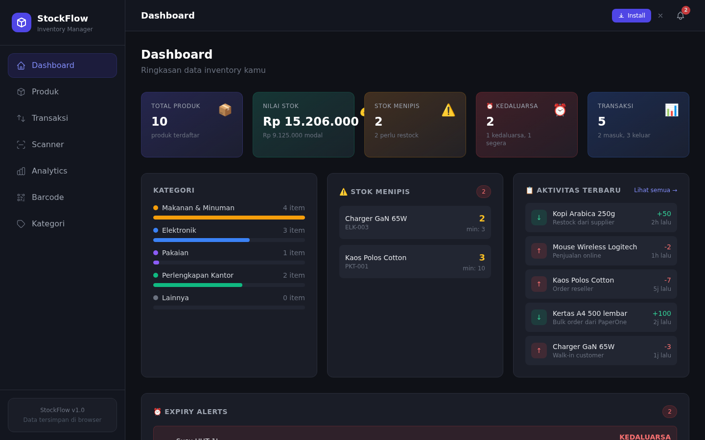
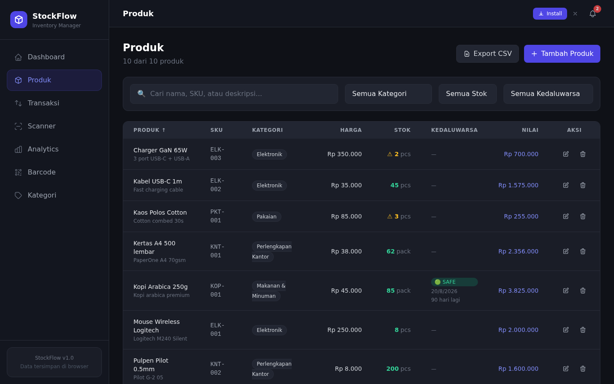
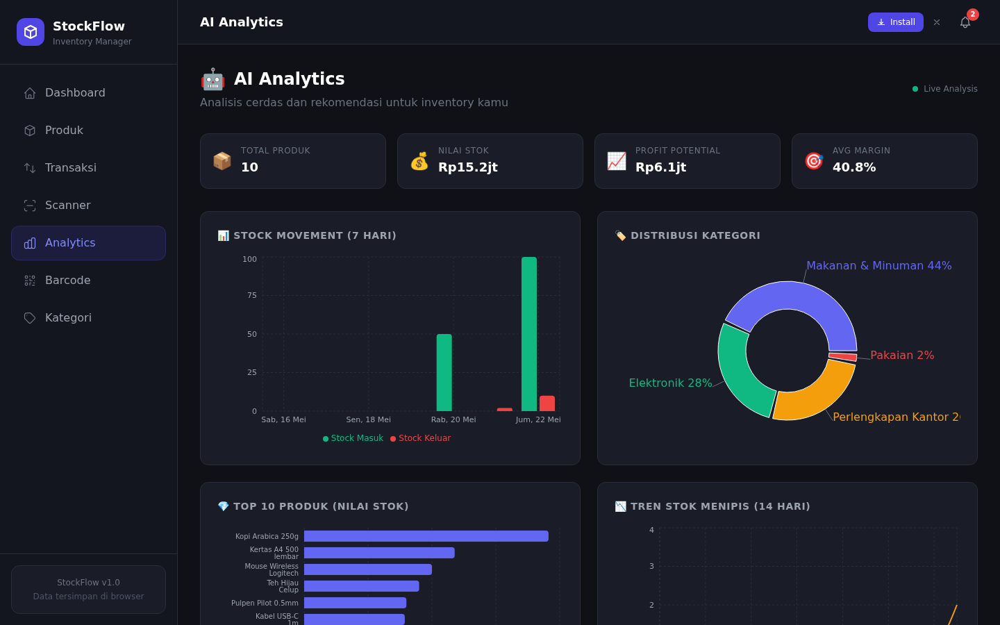
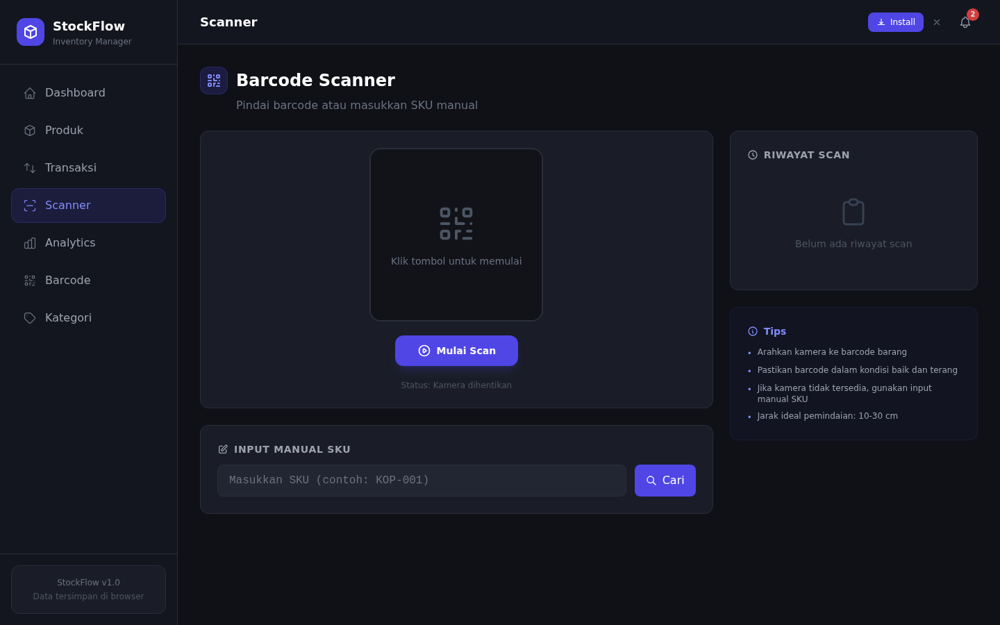
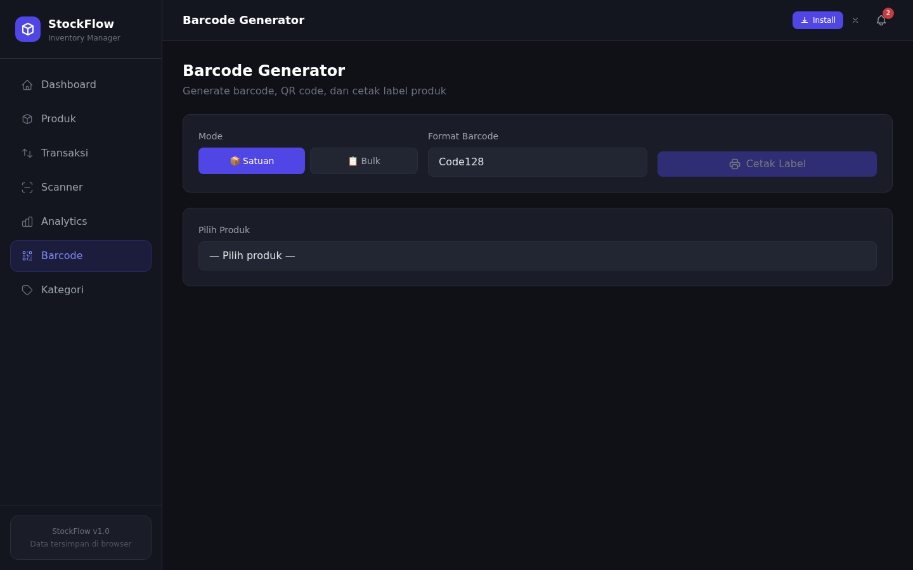

# 📦 StockFlow — Inventory Manager

> Simple, beautiful, and smart inventory management system built with Next.js 14.

Dark-themed PWA inventory app with barcode scanning, barcode generation, expiry tracking, AI-powered analytics, and real-time notifications. Installable on mobile — no server, no database, no signup required.


---

## 📸 Screenshots

| Dashboard | Products | Analytics |
|:---------:|:--------:|:---------:|
|  |  |  |

| Scanner | Barcode Generator |
|:-------:|:-----------------:|
|  |  |

---

## ✨ Features

### 📊 Dashboard
- Overview stats: total products, stock value, low stock alerts, transaction count, expiry warnings
- Category breakdown with progress bars
- Low stock warnings with severity indicators
- ⏰ Expiry alerts: expired (🔴), expiring within 7 days (🟠), expiring within 30 days (🟡)
- Top products by stock value
- Recent activity feed

### 📦 Products (CRUD)
- Add, edit, delete products
- Fields: name, SKU, category, price, cost, stock, min stock, unit, description, **expiry date**
- Expiry status badges: 🔴 EXPIRED / 🟡 EXP. SOON / 🟢 SAFE
- Sort by name, quantity, price, or expiry date
- Search by name, SKU, or description
- Filter by category, stock status, or expiry status
- Export to CSV (includes expiry date)

### 🔄 Transactions
- Stock in / stock out with quantity selection
- Transaction history with timestamps
- Daily in/out stats
- Preview before confirming
- Auto-update product stock

### 📷 Barcode Scanner
- Camera-based barcode scanning (mobile & desktop)
- Auto-search product by SKU after scan
- Quick stock in/out buttons (+1, +5, +10, custom)
- Manual SKU input fallback
- Scan history (last 10 scans)

### 🏷️ Barcode Generator
- Generate **Code128 barcode** from product SKU
- Generate **QR code** with product info (name, SKU, price)
- **Print labels** — 80mm × 50mm template with barcode, name, price, category, expiry date
- **Bulk generate** — select multiple products, print labels at once
- Toggle barcode format: Code128 ↔ EAN-13

### ⏰ Expiry Tracking
- Expiry date field per product (optional)
- Expiry status badges with days remaining/overdue
- Dashboard expiry alerts section (expired → expiring soon → safe)
- Filter products by expiry status
- Sort by expiry date (expired first)
- Helper functions: `getExpiryStatus()`, `getDaysUntilExpiry()`, `getExpiryLabel()`, `sortByExpiry()`

### 📊 AI Analytics
- **Stock Movement** — daily in/out bar chart (7 days)
- **Category Distribution** — pie chart by product count/value
- **Top Products** — horizontal bar chart by stock value
- **Low Stock Trend** — line chart tracking stock levels
- **AI Insights Panel** — intelligent analysis including:
  - Executive summary
  - Restock recommendations
  - Risk alerts (dead stock, overstocked, low margin)
  - Opportunity insights

### 🔔 Notifications
- Bell icon with unread count badge
- Low stock alerts dropdown
- Browser push notifications (with permission)
- Auto-refresh every 30 seconds
- Mark as read per notification

### 🏷️ Categories
- CRUD with color picker (20 colors)
- Product count per category
- Stock value per category
- Prevent deletion if products exist

### 📱 PWA (Progressive Web App)
- Installable on mobile & desktop (Add to Home Screen)
- Offline support via service worker
- App-like standalone experience
- Install button in header (auto-detects browser support)

---

## 🚀 Getting Started

### Prerequisites
- Node.js 18+
- npm or yarn

### Install

```bash
git clone <your-repo-url>
cd stock-manager
npm install
```

### Run Dev

```bash
npm run dev
```

Open [http://localhost:3000](http://localhost:3000)

### Build for Production

```bash
npm run build
npm start
```

### Install as PWA
1. Open the app in Chrome/Edge on mobile or desktop
2. Click the **"Install"** button in the header (or use browser menu → "Install app")
3. App will appear on your home screen like a native app

---

## 📁 Project Structure

```
stock-manager/
├── public/
│   ├── manifest.json           # PWA manifest
│   ├── sw.js                   # Service worker (offline caching)
│   ├── icon.svg                # App icon (SVG)
│   └── icons/
│       ├── icon-192.png        # PWA icon 192×192
│       └── icon-512.png        # PWA icon 512×512
├── src/
│   ├── app/
│   │   ├── layout.tsx          # Root layout with sidebar + header
│   │   ├── page.tsx            # Dashboard
│   │   ├── globals.css         # Global styles + dark theme + print CSS
│   │   ├── products/
│   │   │   └── page.tsx        # Product CRUD table
│   │   ├── transactions/
│   │   │   └── page.tsx        # Stock in/out + history
│   │   ├── scanner/
│   │   │   └── page.tsx        # Barcode scanner (camera)
│   │   ├── barcode/
│   │   │   └── page.tsx        # Barcode generator + print labels
│   │   ├── analytics/
│   │   │   └── page.tsx        # AI analytics dashboard
│   │   └── categories/
│   │       └── page.tsx        # Category management
│   ├── components/
│   │   ├── Sidebar.tsx         # Navigation sidebar (7 items)
│   │   ├── Header.tsx          # Top header with page title
│   │   ├── Modal.tsx           # Reusable modal component
│   │   ├── NotificationBell.tsx # Notification system
│   │   ├── BarcodeScannerWidget.tsx # Camera barcode scanner
│   │   ├── PWAInstall.tsx      # PWA install prompt
│   │   └── ClientInit.tsx      # Client-side init + SW registration
│   └── lib/
│       ├── types.ts            # TypeScript interfaces
│       ├── store.ts            # localStorage CRUD helpers
│       ├── expiry.ts           # Expiry date helpers
│       └── ai-insights.ts      # AI analytics engine
├── package.json
├── tsconfig.json
├── tailwind.config.ts
└── postcss.config.js
```

---

## 🧠 How It Works

### Data Storage
All data is stored in **localStorage** — no backend needed:

| Key | Data |
|---|---|
| `stock_manager_products` | Products array (with expiry dates) |
| `stock_manager_transactions` | Transactions array |
| `stock_manager_categories` | Categories array |
| `stock_manager_notifications_read` | Read notification IDs |

### AI Analytics Engine
The AI insights are generated **purely from data analysis** — no external API calls:

1. **Metrics calculation** — total products, stock value, avg margin, turnover rate
2. **Trend detection** — stock movement patterns over 7 days
3. **Anomaly detection** — dead stock, overstocked items, zero-sales products
4. **Recommendations** — restock timing, bundle suggestions, margin optimization
5. **Risk alerts** — low margin warnings, stock depletion forecasts

### Expiry Tracking
Products can have an optional expiry date. The system automatically:

1. **Calculates status** — expired, expiring soon (≤30 days), or safe
2. **Sorts by urgency** — expired products shown first
3. **Generates alerts** — dashboard widget shows products needing attention
4. **Formats labels** — expiry date included on printed barcode labels

### Barcode System
Two barcode features work together:

- **Scanner** (`/scanner`) — reads barcodes from camera, looks up products by SKU
- **Generator** (`/barcode`) — creates barcodes/QR codes from SKU, prints labels

### Demo Data
On first load, the app seeds 10 demo products (including items with expiry dates) across 5 categories with 5 sample transactions to showcase all features.

### PWA & Offline
- Service worker caches all static assets on install
- Navigations serve from cache first, then network
- Offline fallback serves the cached app shell
- Data stays in localStorage — works fully offline

---

## 🎨 Design

- **Theme**: Dark mode with indigo accent (`#6366f1`)
- **Typography**: System font stack (no external fonts)
- **Components**: Custom CSS classes (`.card`, `.btn-primary`, `.input`, `.badge-*`)
- **Layout**: Fixed sidebar (256px) + top header (64px) + scrollable content
- **Print**: CSS `@media print` for barcode label printing

---

## 🛠️ Tech Stack

| Technology | Purpose |
|---|---|
| Next.js 14 | React framework (App Router) |
| TypeScript | Type safety |
| Tailwind CSS | Utility-first styling |
| Recharts | Chart components |
| html5-qrcode | Camera barcode scanning |
| JsBarcode | Barcode generation (Code128, EAN-13) |
| qrcode | QR code generation |
| uuid | Unique ID generation |
| localStorage | Client-side data persistence |
| Service Worker | PWA offline caching |

---

## 📝 License

MIT — feel free to use, modify, and distribute.

---

Built with 🔥 by [Andretukangoprek](https://github.com/amelzloveindra2)
